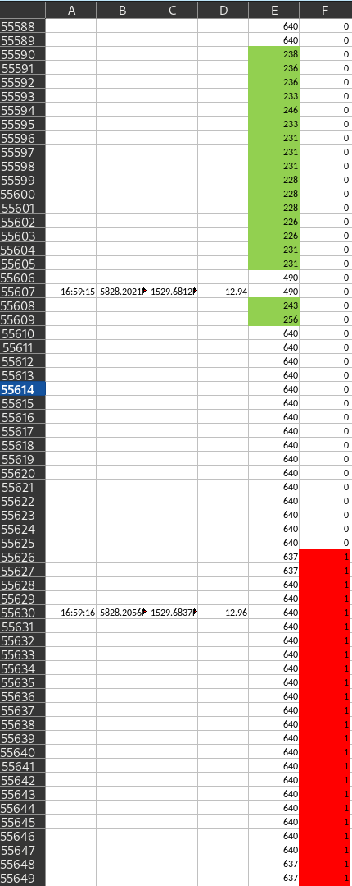
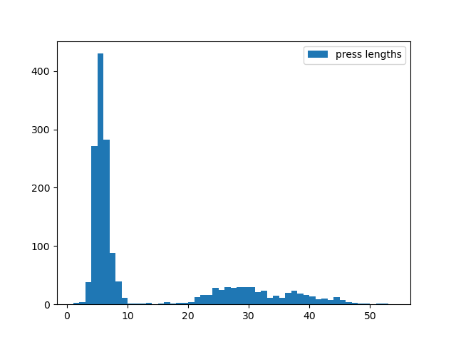
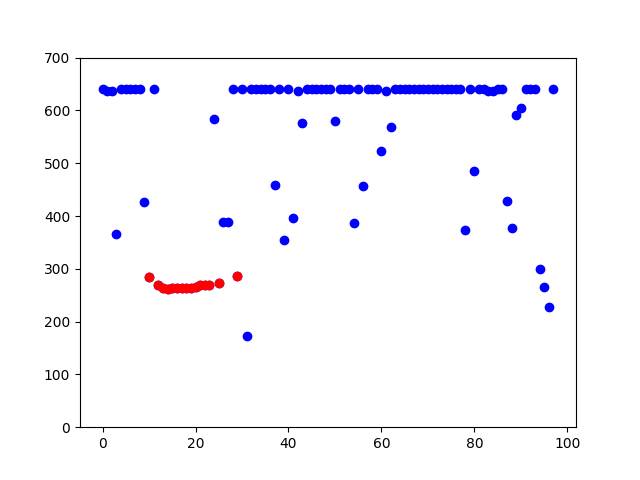
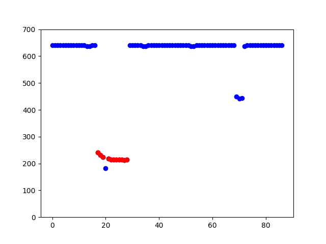

# overtaking

Python project with code analyzing overtaking distances.

We have access to various data taken while riding a bike in traffic (focus is on rural roads). The sensors/devices we are currently using are the following: 

- box 
- garmin Varia radar
- rear-facing camera

### Box

A non-commercial (DIY) device that we have access to for measuring lateral distance to the road-side of the bike until the next object or up to ~6 meters. 

The box measures lateral distance at frequency of 22Hz and creates a record in a csv/txt file with some metadata attached to each such lateral distance measurement (see prinscreen for an idea of what it looks like):
1. Time stamp (if it happens to be a full second, i.e. every 22nd time) 
2. GPS position (lat, long) 
3. Speed (of the bike where the box is) 
4. Lateral distance to the next object or max out 
5. Button press: 0/1 




The rider presses a button when an event is happening. Short button press for oncoming pass, long press for overtaking pass.

For this project, we keep the data from all devices in the following structure. It simplifies the utility functions. Camera files (videos) are too big to casually keep with the rest of the data, so we access them individually. 

``` text
BikeLogs
	|---- 20221218
	|          |--- 20221218_ANALOG18.TXT
	|          |--- 20221218_Forerunner645.fit
	|          |--- 20221218_Wahoo.fit
	|---- 20230116
	|          |--- 20230116_ANALOG18.TXT
	|          |--- 20230116_Forerunner645.fit
	|          |--- 20230116_Wahoo.fit
```

and that the `BikeLogs` folder is located in `$(HOME)/Downloads`. If you want your `BikeLogs` folder elsewhere, modify values in `src/constants.py`. 

This repository mostly focuses on detection and analysis of events recorded with the box. All other data is mostly to help us ascertain the events that we identify from the primary box records. We care about not having many false positives/negatives and wrong lateral distance readings, e.g. due to noise in the environment or device errors. 

### Radar

The `.fit` file contains Radar information. While we can access this data and process it, we have not utilized it yet. The hope is to use it for cross-checking the overtaking detections that we get from other sources. 

### Camera

Rear facing camera should, in theory, be another source of information that can verify or refute a detected overtake. Right now, we are able to process individual frames from such recordings and detect vehicles in them. We make use of YOLOv8 library. For our purposes, we find it sufficient to use their pre-trained `large` model. You can find the example detection in the Actions tab of this repo. Artifacts of the `Detect vehicles` workflow contain examples of such detections made on the sample frames we provide with the code. 

## Example

Clone this project and navigate to it

``` bash
$ git clone https://github.com/jsliacan/overtaking.git
$ cd overtaking
```
From here, you can type `python3 .` to run the script in `__main__.py`, which we treat as a collection of scripts utilizing the functions in the packages `box`, `radar`, etc.

## Events

An *event* is either an overtake (OT) or an oncoming pass (OC). Both these events are marked in the `txt` file by a *button press* -- a long one for an OT and a short one for an OC.



For now, we assume the event was an OT if the press length is >10 lines long (there's a record/line each 1/22s). If the press is <9 long, we assume it was an OC. The ambiguous lengths of 9 and 10 aren't yet treated.

The way we detect each event associated with a button press is as follows:

1. For an OT press, we search 100 lines back in time (or down to the previous press).
2. For an OC press, we do the same except in the opposite direction.

In each case, we get a vector of lateral distances of length N as defined in 1. and 2. From this vector, we somehow need to discern which lateral distances correspond to the event. Let us restrict our attention to OT events for simplicity. The method, in short, is the following. We rely on a community detection algorithm provided by the `networkx` package. The algorithm is an approximation (with some guarantees) to finding the partition of a graph that is optimal with respect to maximizing the *modularity* measure associated with such partition of *G*. The reduction we use to convert our vector of lateral distances to a graph *G* that we can feed to the algorithm is rather simplistic: let *V(G)* be the set of all lateral distances in our vector. Two vertices *x,y* in *V* form an edge of *G* if and only if *d(x,y) = abs(x-y)* is less than 40cm. We place no restriction on how far in time the two vertices can be. On a *G* obtained this way, we then run the Louvain algorithm and observe the partition *P* that it constructs. From *P*, we dismiss all parts *p* such that *min(x in p) > 500cm* as those parts most likely form a default distance where the box maxes out. Furthermore, we dismiss erroneous readings that form parts which satisfy *max(x in p) < 50cm*. Given that the box is laterally in the center of the bike, 50cm is an unrealistic overtaking distance as the width of the rider plus the width of the wing mirror would likely be greater than 50cm, meaning that a collision occurred. Apart from a few litlte tricks, we basically take the next largest partition we get in *P*. However, the box misbehaves and sometimes it makes some very odd (jumpy) readings. So we want to exclude these from what otherwise would be a reasonable set of OT lat. distances. Consider the following examples:



To extract the right OT event (in red), it was enough to apply the method above. However, in the following case we apply a post-detection correction to eliminate the reading that would give an incorrect minimum overtaking distance (smaller than it should be).



The post-detection correction consists of taking the detected part *p* in partition *P* and extracting the largest clique *c* from the restriction of *G* onto *p*, *G[p]*. However, we add back vertices which are connected to a large enough fraction of that clique, currently *0.7|c|*. 

*Note: We currently also dismiss parts with <4 vertices. However, this is supposed to work correctly in conjunction with a fix that has not yet been implemented: if the OT event overlaps with a button press, we need to detect the overlapping part of the event too. Right now, only non-overlaping lat.dist. readings of the event are detected.*

